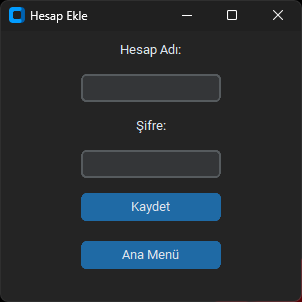
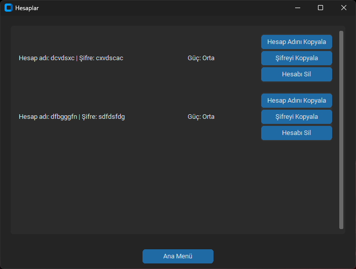
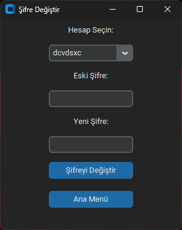
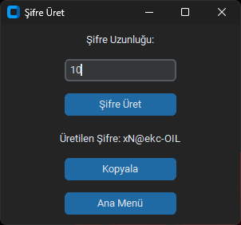

# Password Manager

This project is a Password Manager developed using Python and CustomTkinter. It allows you to securely store, manage your passwords, and generate strong passwords.

## Features

- **Add/Delete Accounts:** Easily add your accounts and delete selected accounts from the list.
- **Password Generator:** Includes a built-in password generator for creating strong, random passwords.
- **Password Strength Analysis:** Incorporates a tool that analyzes how strong passwords are.
- **Username and Password Copying:** Copy your account information to the clipboard with a single click.
- **Theme Options:** Offers the option to use the application in light or dark theme mode.

## Nasıl Çalıştırılır

## How to Run

1. Clone the project:

   ```bash
   git clone https://github.com/MertAlii/Python-Projects.git
   ```

2. Install the required packages:
   ```bash
   pip install customtkinter
   pip install CTkMessagebox
   pip install cryptography
   pip install pyperclip
   ```

## Screenshots

Below you can find screenshots of the application:










